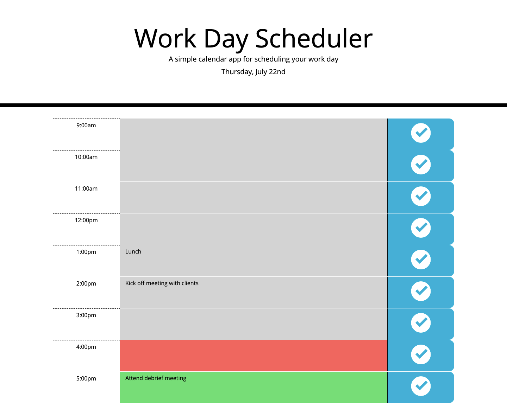

# Work Day Scheduler Starter Code

## Description

This is a simple calendar application that allows a user to save events for each hour of the day. This app will run in the browser and feature dynamically updated HTML and CSS powered by jQuery.

At opening the app, the current day is displayed at the top of the calendar using Moment.js. The time blocks for standard business hours are color-coded to indicate whether it is in the past, present, or future. The color will update automatically every half an hour, so that  users do not need to refresh the browser manually. When users click into a time block, they can enter an event and save it by clicking the save button. The event is saved in local storage and will persist when users refresh the page.

## Built With
* HTML
* CSS
* jQuery
* Moment.js
* localStorage

## Website
https://siyanguo.github.io/work-day-schedule/

## Contribution
< > with ❤️ by Serena Guo

